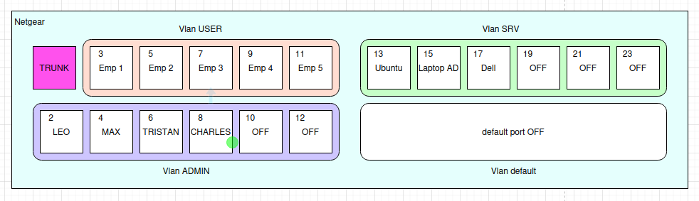

# 🖧 Documentation de l'Infrastructure Réseau - Configuration du Switch Netgear

---

## 📖 Sommaire
1. 🎯 [Introduction](#1-introduction)
2. 📌 [Table des VLANs](#2-table-des-vlans)
3. ⚙️ [Configuration du Switch Netgear](#3-configuration-du-switch-netgear)
4. 🔒 [Sécurisation des VLANs](#4-securisation-des-vlans)
5. ✅ [Tests et Validation](#5-tests-et-validation)

---

## 🎯 1. Introduction
L'objectif de cette documentation est de détailler la **configuration des VLANs** sur un **switch Netgear manageable 24 ports** `(IP : 192.168.0.115)`. Les **VLANs** permettent de segmenter le réseau en différentes zones sécurisées et d'optimiser la gestion du trafic. 🚀

---

## 📌 2. Table des VLANs

| VLAN | 📛 **Nom** | 🌍 **Adresse Réseau** | 📜 **Description** |
|------|-------------|----------------------|-----------------------------|
| 2   | **Admin**       | 192.168.2.x/24       | VLAN réservé aux administrateurs réseau |
| 3   | **Utilisateurs**| 192.168.3.x/24       | VLAN destiné aux utilisateurs standards |
| 4   | **Services**    | 192.168.4.x/24       | VLAN pour tous les services internes |
| 5   | **WiFi Admin**  | 192.168.5.x/24       | VLAN pour l'administration WiFi |
| 6   | **WiFi Users**  | 192.168.5.x/24       | VLAN pour les utilisateurs WiFi |


> note : *Wifi Admin and Users is configured with owenWrt*

---

## ⚙️ 3. Configuration du Switch Netgear

> *Schéma des attribution des ports selon les VLAN*


### 🛠️ Étapes de Configuration via l'Interface Web Netgear
1. 🔗 **Se connecter** à l'interface web du switch : `http://192.168.0.115`
2. 🔄 **Accéder à** `Switching > VLAN > VLAN Configuration`
3. ➕ **Créer les VLANs** `2, 3, 4`  
4. 🖥️ **Attribuer les ports** Aller dans `Switching > VLAN > Vlan jcpquoi`
selon le tableau suivant :

| VLAN | 🔌 **Ports Assignés** |
|------|----------------------|
| 2 (Admin)     | 2,4,6,8,10,12     |
| 3 (Users)     | 3,5,7,9,11        |
| 4 (Services)  | 13,15,17,19,21,23 |

5. 🔄 **Configurer les ports** Aller dans `Switching > VLAN > finir le chemin jcpcquoi` 
Pour chaque vlan, mettez les ports en mode `UNTAG` pour les ports attribué, et `TAG` pour le port 1. Mettez rien pour les autres ports.
6. 💾 **Appliquer la configuration** et effectuer des tests.

---

## 🔒 4. Sécurisation des VLANs

- 🔐 **Restreindre l'accès au VLAN Admin (2)** en appliquant des règles ACL.
- 🛑 **Isoler les VLANs utilisateurs et services** pour éviter le trafic inter-VLAN non autorisé.
- 🔑 **Activer 802.1X** pour sécuriser les accès aux VLANs sensibles.
- 🔥 **Configurer un pare-feu** pour filtrer les accès entre VLANs.

📜 **Exemple de règle ACL** pour bloquer l'accès au VLAN Admin depuis le VLAN Utilisateurs :
```shell
access-list 100 deny ip 192.168.3.0 0.0.0.255 192.168.2.0 0.0.0.255
access-list 100 permit ip any any
```

---

## ✅ 5. Tests et Validation

1. 🔎 **Vérifier l'accès réseau** : Chaque VLAN doit pouvoir accéder uniquement à ses ressources.
2. 🔄 **Tester l'assignation des ports** : Vérifier que les VLANs sont bien isolés.
3. 🚨 **Tester les ACLs** : Vérifier que les restrictions fonctionnent.
4. 📊 **Monitorer le trafic** : Utiliser `tcpdump` ou `Wireshark` pour analyser le trafic.

---

## 🎯 Conclusion
Cette documentation fournit une **vue d'ensemble complète** de la configuration des VLANs sur le **switch Netgear** `(192.168.0.115)`. Assurez-vous de **tester et sécuriser** votre infrastructure pour garantir un réseau performant et protégé. 🚀

